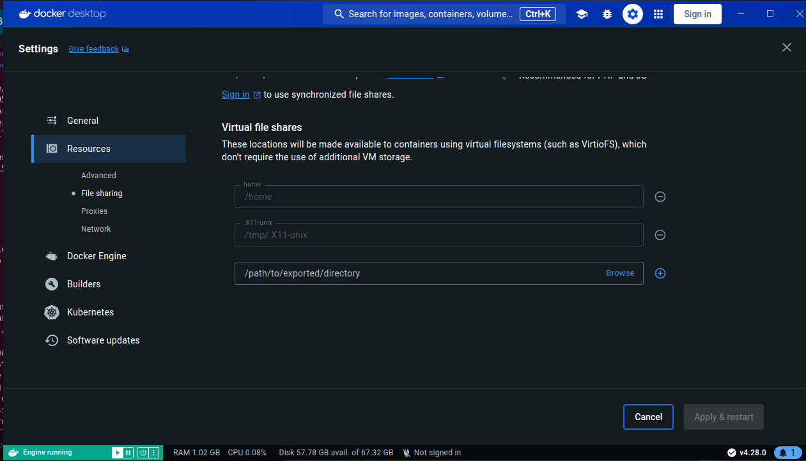

# Running ROS Noetic with Docker 101

This tutorial assume you are running Ubuntu 22.0.4 LTS.

The procedure was tested on a Dell XPS.

1. Install Docker

```bash
chmod +x ./download-docker-desktop.sh
./download-docker-desktop.sh
```
Now, with the deb file downloaded, you can run `./setup.sh`

```bash
./setup.sh
```

2. Allow access to the `/tmp/.X11-unix` directory

  
