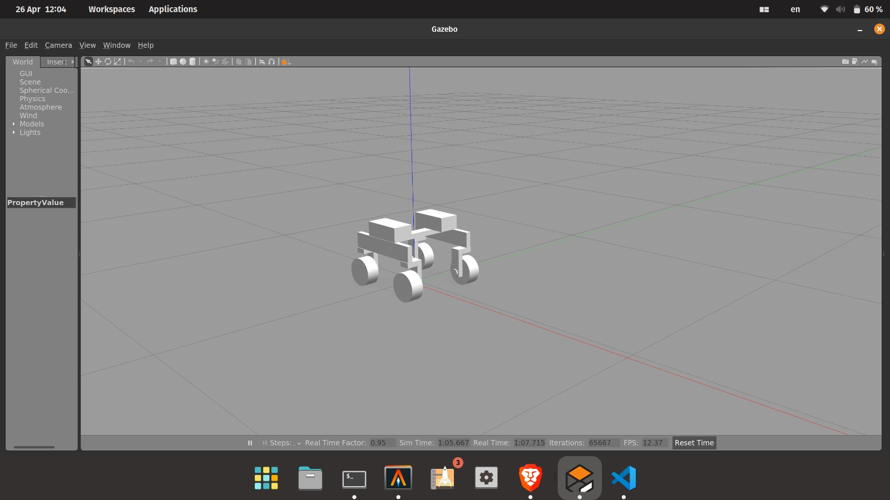
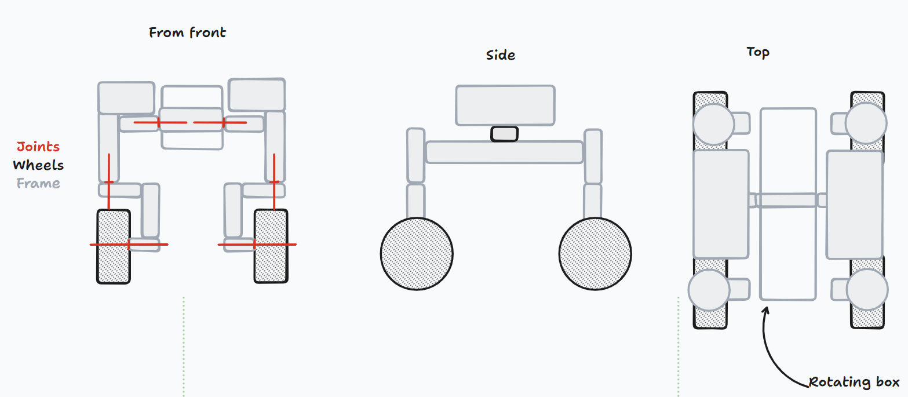
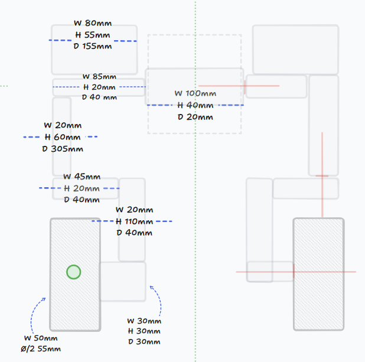
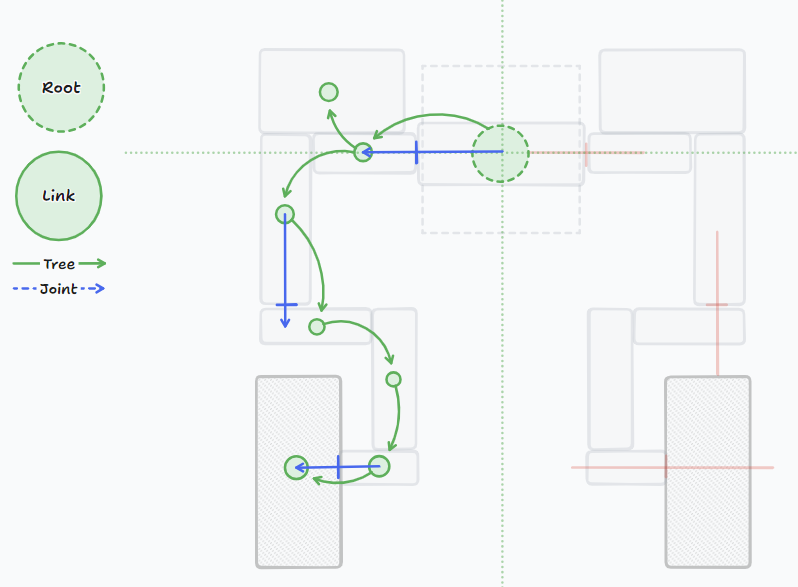

# 06/05/2024

We distributed the tasks, see [TODO.md](TODO.md)

- [ ] Make the steering ackerman (car-like) (Milan and Kiril)
- [ ] Fix the weight distribution (everything currently weights 1 kg) (Jonas)
- [ ] Change the URDF (Erik) - The joints above the wheels are fixed, Erik needs to look into if statements in XML, they are not turning correctly (Erik)

# 02/05/2024

Erik have gotten the robot to be controlled by the keyboard in the gazebo simulation.

# 26/04/2024

Today, we created a gazebo package by running:

```bash
catkin  create pkg marvin_gazebo
```

in the src folder.

This initializes an empty package, that we can use to make our simulation of the robot.

We will create a custom `.world` file, which finds our robot and loads it into the simulation.
along with a `.launch` file that will launch the simulation.

We reference the world file in the launch file.


Now we try to run the simulation by running this in the `src` folder:

```bash
source ./devel/setup.bash
roslaunch marvin_gazebo marvin.launch
```

Now we can see the robot in the gazebo simulation if we spawn it in another terminal in the src folder:

```bash
rosrun gazebo_ros spawn_model -file marvin_model/urdf/marvin_dev.urdf -urdf -x 0 -y 0 -z 1 -model MARVIN
```




You can save the view into a new `.world` file, just remember to make it executable by running:

```bash
chmod +x marvin_with_robot.launch
```

# 22/04/2024

Eric converted our drawing into an `urdf` file.

# 19/04/2024

We drew the robot on [TLDRAW](https://www.tldraw.com/r/4b5c9L8QwUOHz1gBu0vhn?v=-154,661,2634,1250&p=page)





and took measurements.


and planned links and joints.


