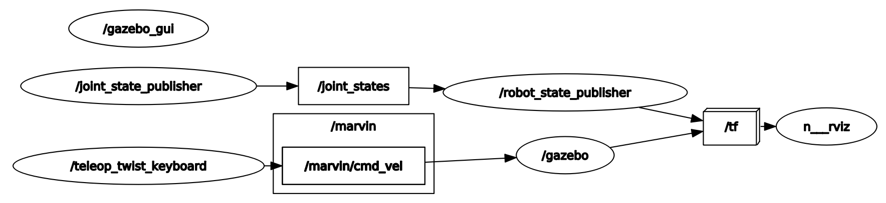
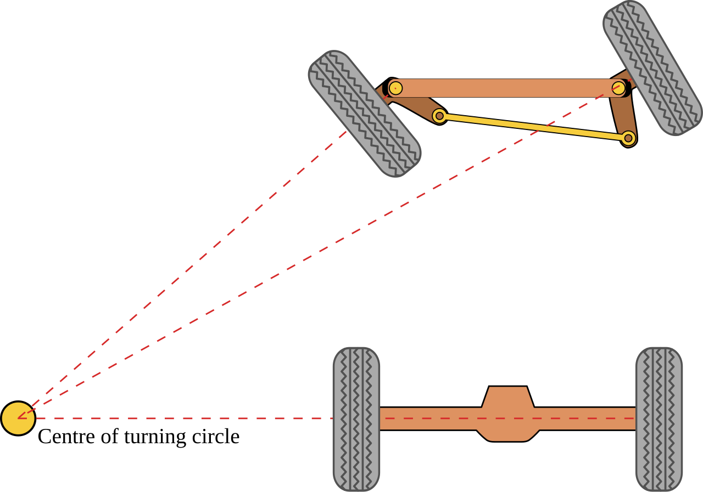

# Marvin Control

This directory contains all relevant code for different types of steering that can be used with the robot. As of right now, only skid steering and Ackermann steering are successfully implemented.

## Skid steering

Skid steering is implemented via Gazebo's built-in module. To control, publish a Twist message to the `marvin/cmd_vel` topic. Below is a diagram showing how messages flow in the Ackermann model. The communication model is given below:



For launching the skid steering model, run the following:

```bash
roslaunch marvin_control marvin_skid_teleop.launch
```

Then any publishing to the marvin/cmd_vel topic will control the robot. These are the following possibilities for control:

1. To **start the teleop control**, run:

    ```bash
    rosrun teleop_twist_keyboard teleop_twist_keyboard.py cmd_vel:=/marvin/cmd_vel
    ```

    You will know this is successfull if you see small table with explanations for control of the vehicle.

or

1. For **starting the movement planner**, run:

    ```bash
    rosrun marvin_plan hermit_curves_movement.py
    ```

    You will know this is successfull if you see a message "Node has been started" and a description of targets will show

## Ackermann steering
In Ackermann steering, the front wheels are responsible for steering, while the rear wheels remain fixed. The inner front wheel turns more sharply than the outer front wheel during a turn, ensuring that all wheels follow paths that have a common center of curvature. Ackermann logic is done in the fallowing python scripts acker.py, cmd_vel_to_joint.py, command_to_joint_state.py. 

The turning center is the point around which the vehicle turns. For proper Ackermann steering, the paths of all four wheels should intersect at this turning center, allowing the vehicle to turn smoothly without skidding.




1. acker.py

    This script is primarily responsible for calculating the appropriate steering angles based on the vehicle’s geometry and movement commands.
    The function get_angle() calculates the steering angle of each wheel relative to the turning center based on the current position of the wheels and the desired steering input.

    This script translates incoming steering commands into specific joint states, effectively controlling the steering joints of the robot.
	The command_callback() function updates the positions of the steering joints based on the received command values, setting the angles for the front wheels.

2. cmd_vel_to_joint.py

    This script processes velocity commands (cmd_vel) and converts them into appropriate joint movements for steering and driving the wheels.

3. command_to_joint_state.py

    The control loops in these scripts constantly update the vehicle’s steering and wheel positions in response to commands. This ensures that the robot maintains proper Ackermann steering geometry throughout its movements.

    The spawner node and controller setup manage these updates in real-time, keeping the robot’s wheels correctly aligned during various maneuvers.

## Swerve steering

## Work distribution

- Erik: Implemented skid steering, helped with debugging of Ackermann steering
- Jonas: Helped with debugging of skid steering
- Milan: Implementation of Ackermann steering
- Kirill: - 
