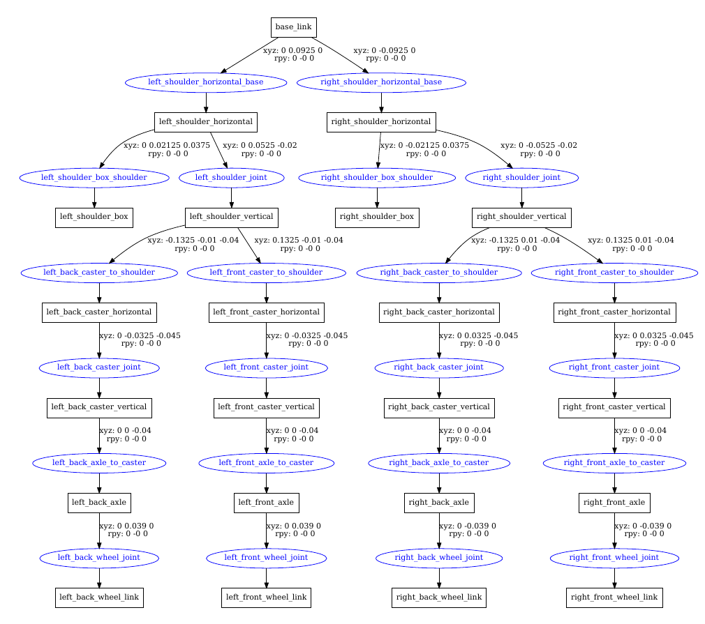
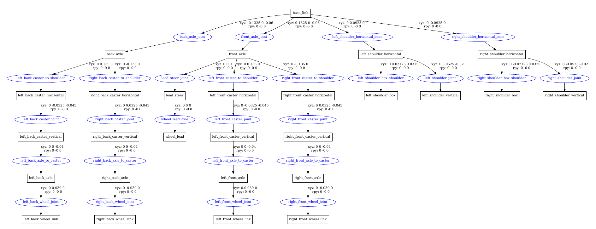

# Robot Description

This directory contains all relevant information concerning driving configurations for the robot. There are 3 types of steering that we created models for:

- Skid steering
- Ackermann steering
- Swerve steering

The folder structure is the following:

- `launch`: contains all the launch files
- `urdf`: contains all the xacro and urdf files for the different robot models

## Launch files

There are 3 launch files. One for each type of steering. Each one does the same thing: it launches rviz with the corresponding model. Together with rviz it will also launch a GUI that shows all the different joints that can be controlled with a specific type of model. There are 3 available models:

- Skid steering
- Ackermann steering
- Swerve steering

To launch a 3D visualisation for any type of robot one would do the following:

```bash
roslaunch marvin_description marvin_skid.launch
```

## URDF

- how measurements were made
- what model sketch was being followed (link to sketch file)

The urdf files for the different robots all take from the samples modular parts defined in the `urdf` folder. The only difference between the robots is whether the turning casters are set to be fixed or whether they are set to be movable joints. Each part of the robot has been carefully measured (including weight) and since rviz uses the metric system, our robots are almost perfect replicas to the real-world robot. Initially we [sketched](https://www.tldraw.com/r/4b5c9L8QwUOHz1gBu0vhn?v=697,29,1920,936&p=page) the robot, which was then used as a guide for creating the 3D models. 

Xacro was used so that the parts only had to be defined once, this allowed for fast prototyping while ensuring that all the changes were reflected in each robot instantaneously. 

Each movable component (wheels, casters for steerable robots) has a gazebo transmission element assigned to it. This allows for easier integration into the Gazebo simulation environment. To make it easier for reading, any further information concerning Gazebo is stored in `marvin_type_of_steering.gazebo`.

Below you can find graph representation of the xacro files.

### Skid steering and swerve steering



### Ackermann steering

The Ackermann steering model differs in the way it implements the steering axle. The model follows a "bicycle" model, i.e. there are 2 ghost wheels in the middle that are the ones that receive commands. These two then propagate the message to each of its respectable wheels.



## Work distribution

- Erik: Worked on creating the xacro models and respectable launch files. Helped with measuring of the robot parts.
- Jonas: Drew the initial sketch of the robot. Calculated measurements and weights of each robot part.
- Kirill: -
- Milan: - 
