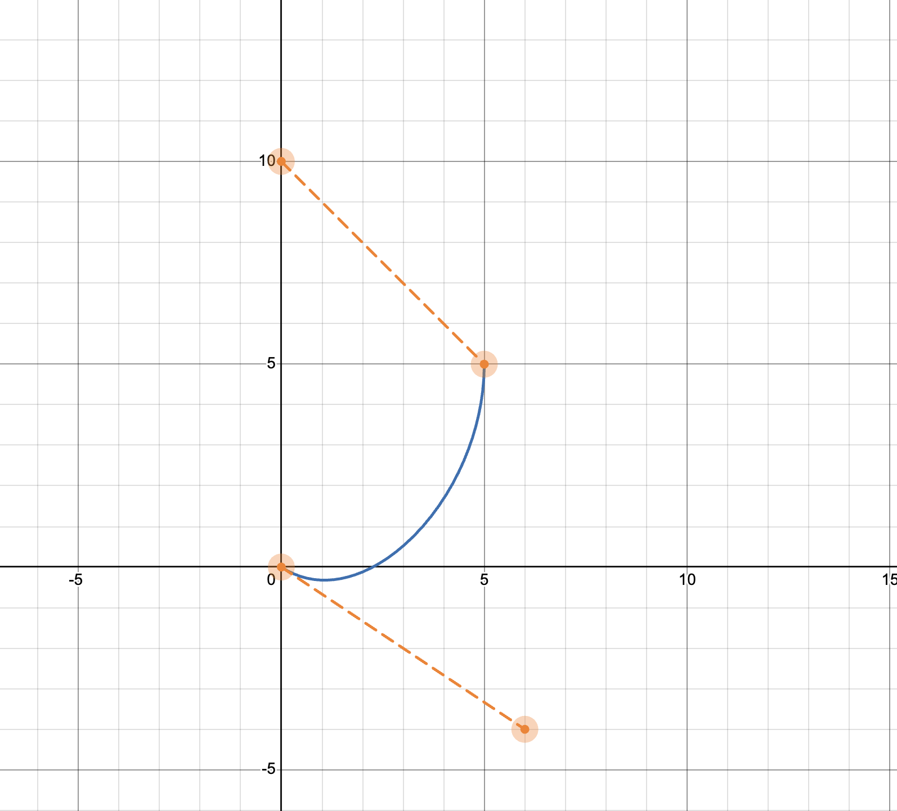
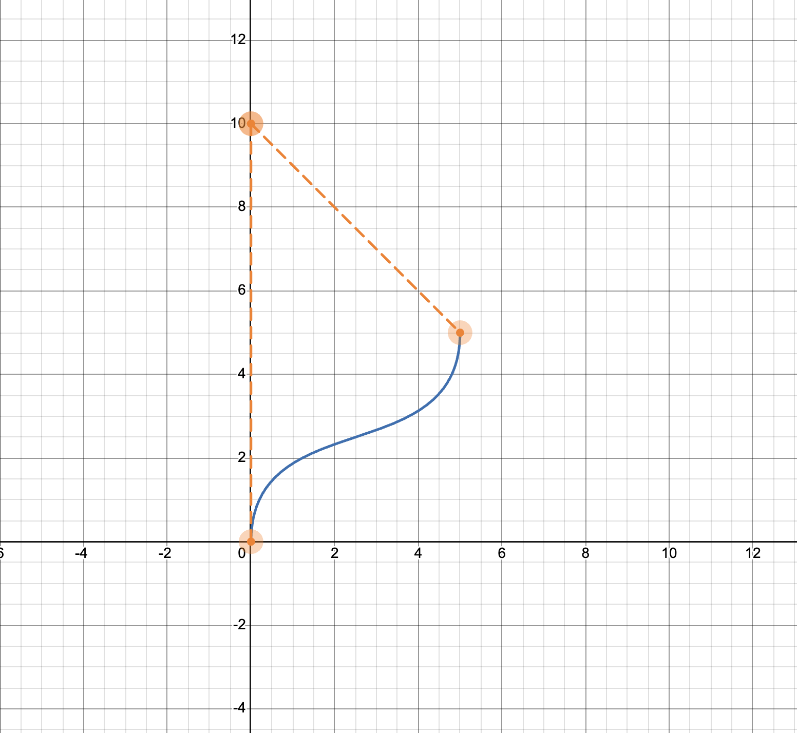
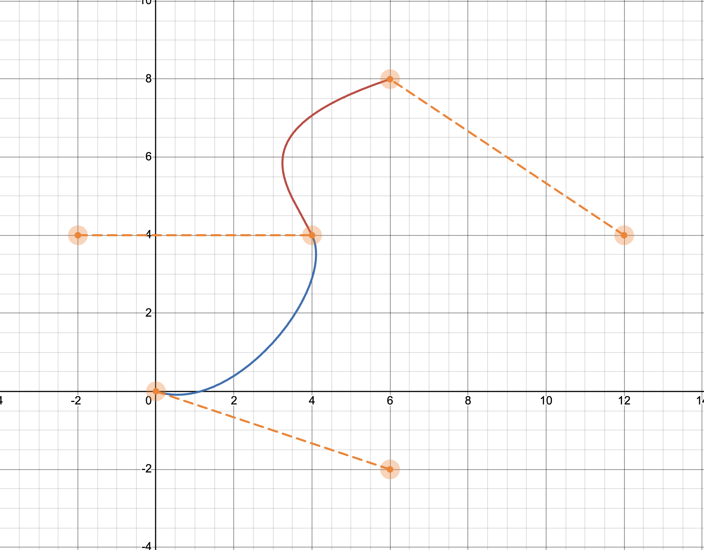

# How to use

## Setup
Steps 1 and 2 are also decribed in project README.md
1. Open a terminal, navigate to the source folder and run.
    ```
    catkin build
    source /opt/ros/noetic/setup.bash
    source /devel/setup.bash
    ```

2. Run **gazebo, rviz and topic publisher** using
    ```
    roslaunch marvin_control marvin_skid_teleop.launch
    ```
    or
    ```
    roslaunch marvin_ackermann_gazebo_control_control marvin_ackermann_gazebo_control_control.launch 
    ```

3. Run the node for planning
    ```
    rosrun marvin_plan hermit_curves_movement.py
    ```

4. Define the array of points inside the script, if needed

Robot goes through the curve and stop at the end

**!By default node is using topics for skid steering. If you need to use it for ackermann steering you need to change corresponding publisher and subscriber topics** 

## Examples

For visualizing how the actual curve will look like the following tool was used: https://www.desmos.com/calculator/5knm5tkr8m

### Curve
{width=60% height=60%}

### Demo


#### Curve
{width=60% height=60%}

#### Demo


#### Curve 
{width=60% height=60%}

#### Demo
<!-- video3 -->


You can set up any points and tangent vectors in the waypoints array in the code. Factors for computing linear velocity and angular velocity can also be changed in the corresponding functions.

# Flow

* rospy was used for writing the script
* different hyperparameters (factors) were used and the best were remained
